# PNU_computerApplication-2017-PNU_Library
PNU_computerApplication-2017-PNU_Library
부산대학교 정보컴퓨터공학부 4학년 1학기 '컴퓨터 응용 설계 및 실험'의 텀 프로젝트로써 
부산대학교 도서관 시스템 개발을 진행했다.
PHP, MySQL을 사용했다.
---
## 도서 검색
소장된 도서 검색한다.
카테고리를 선택하고 키워드로 검색한다.
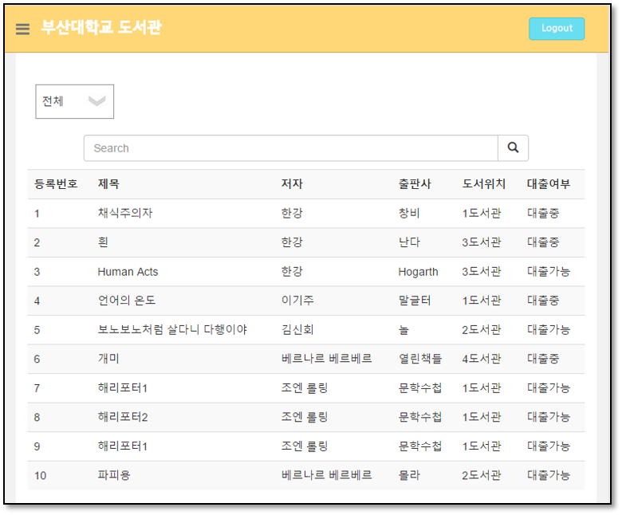
---
## 대출 도서 조회
사용자의 대출된 도서를 조회한다.
대출도서 기간연장이 가능하다.
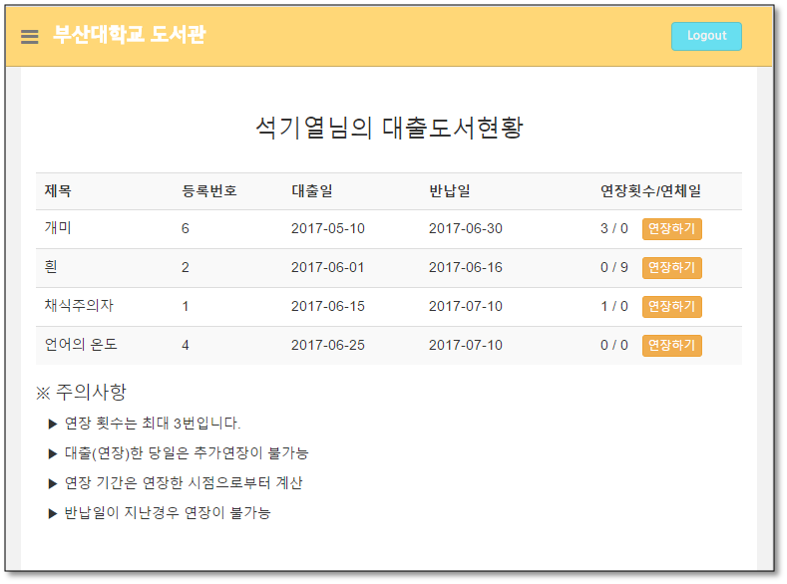
---
## 도서 관리
관리자 계정으로 접속했을 때만 접근 가능하다.
도서 정보의 등록, 삭제가 가능하다.
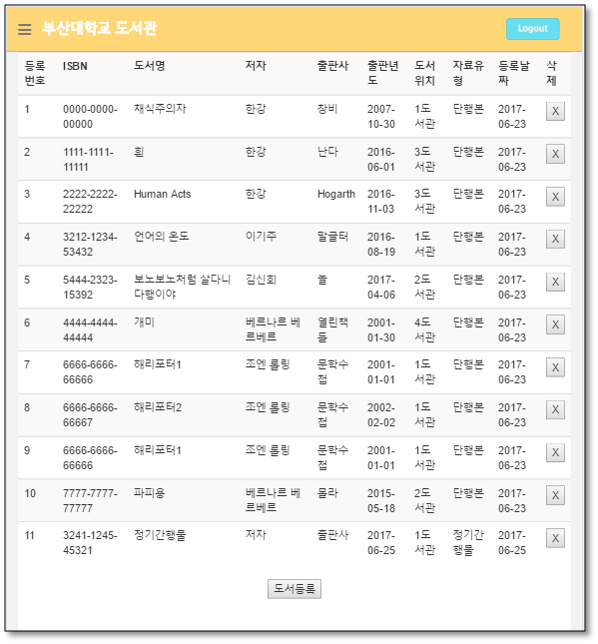
### 도서 등록
ISBN, 도서명, 저자, 출판사, 출판년도, 도서위치, 자료유형을 모두 입력해야만 도서 등록이 가능하다.
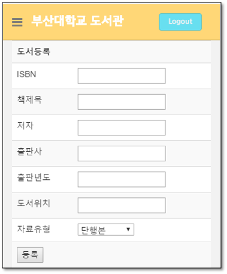
---
## 그룹 스터디 룸 예약
예약 하고자 하는 스터디 룸을 선택한다.
존재하는 스터디 룸만 나타납니다
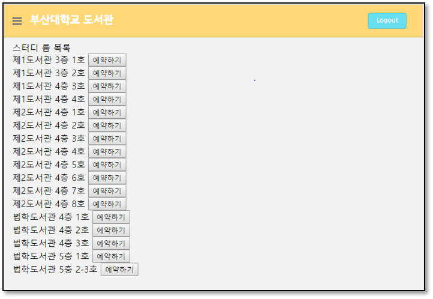
각 스터디 룸의 시간 별 예약 여부를 조회한다.
3일 이내로 연속 2시간 까지 예약이 가능하다.
스터디 룸은 이용시간과 5명의 회원이름, 회원번호로 예약한다.
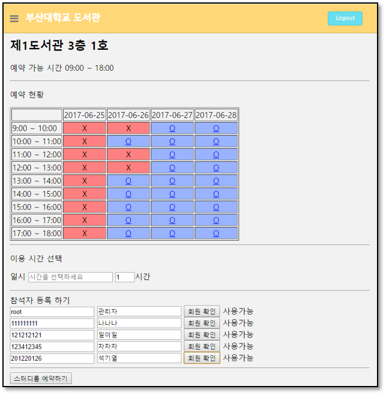
---
## 그룹 스터디 룸 예약 조회
로그인한 회원이 예약한 스터디 룸 예약 정보 조회가 가능하다.
만료된 예약과 진행중인 예약을 구분해서 조회 할 수 있다.
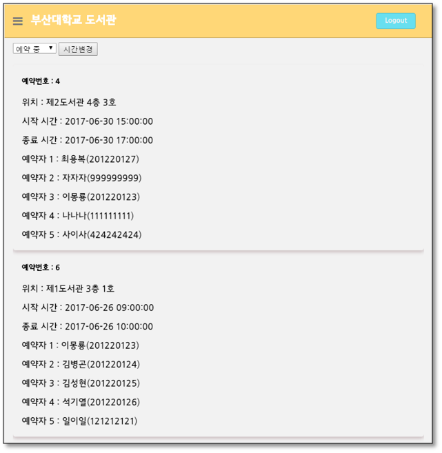
---
## 열람실 좌석 조회
실시간 열람실 좌석현황을 확인한다.
색의 구별로 사융중인 좌석과 비어있는 좌석을 확인한다.
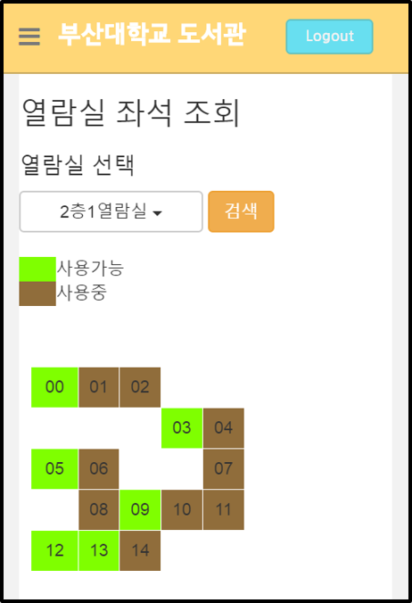
---
## 열람실 좌석 연장
사용자가 사용중인 열람실 좌석정보를 확인한다.
좌석연장이 가능하다.
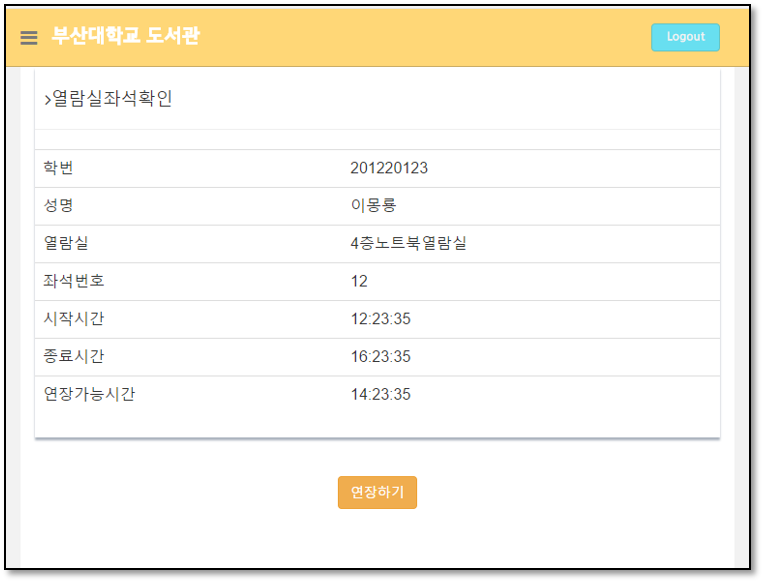
---
## 문의사항(Q&A)
로그인한 사용자는 문의사항을 등록할 수 있다.
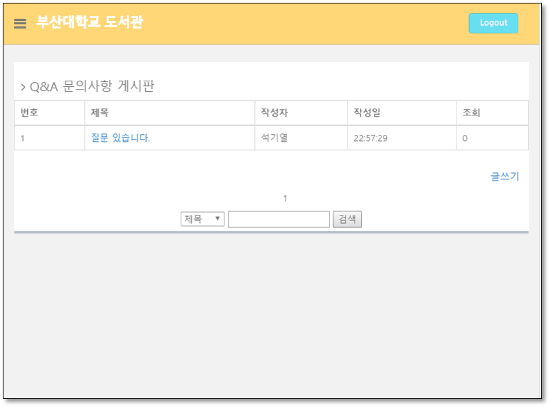
문의사항에 대한 답변은 관리자만 가능하다.
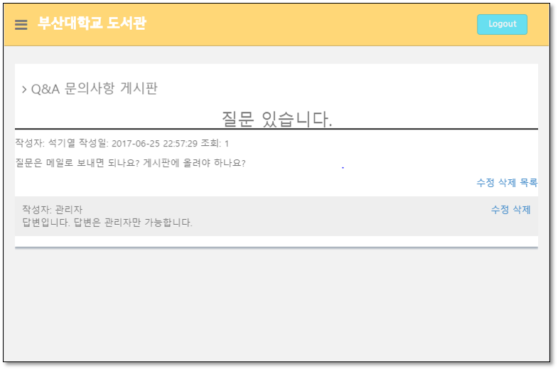